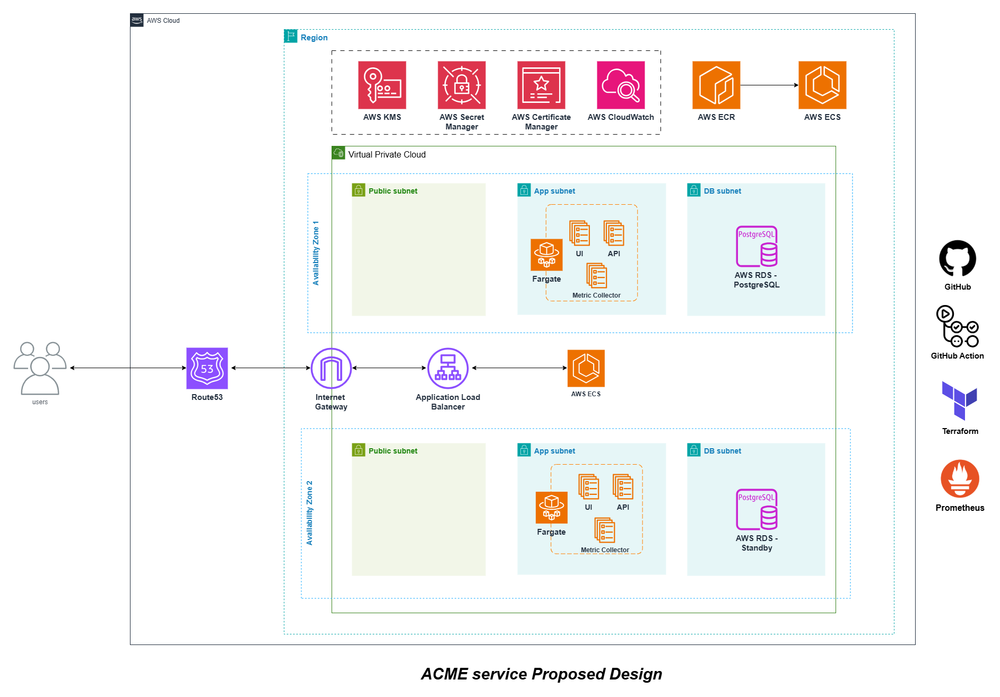
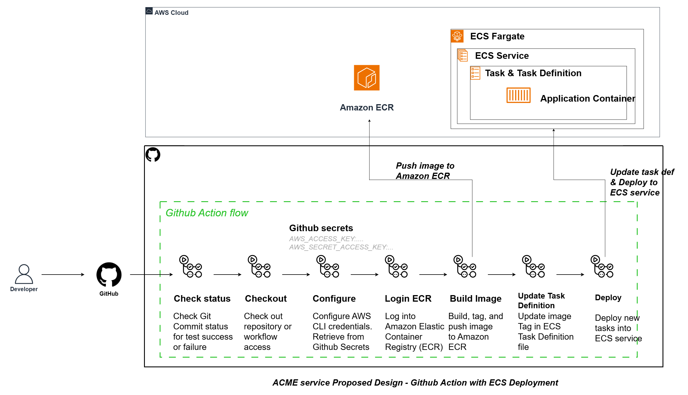

# ACME Cloud Infrastructure Solution

**Author:** Nguyễn Đình Lâm
**Date:** November 22, 2025  
**Cloud Provider:** Amazon Web Services (AWS)

---

## Table of Contents

1. [Executive Summary](#executive-summary)
2. [Architecture Overview](#architecture-overview)
3. [Deployment Automation & Zero-Downtime Updates](#deployment-automation--zero-downtime-updates)
4. [Security & Zero-Trust Networking](#security--zero-trust-networking)
5. [Backups, Disaster Recovery & Resilience](#backups-disaster-recovery--resilience)
6. [Risk Analysis & Collaboration](#risk-analysis--collaboration)

---

## Executive Summary

This document presents AWS infrastructure design for ACME service with modern DevOps practices. The solution leverages ECS Fargate for containerized workloads, RDS PostgreSQL for database, Application Load Balancer for traffic distribution, and a comprehensive CI/CD pipeline with GitHub Actions.

**Key Highlights:**

- **Multi-AZ deployment** across 2 Availability Zones for High Availability
- **Zero-downtime deployments** via ECS rolling updates
- **Infrastructure-as-Code** using Terraform
- **Automated CI/CD** pipeline with GitHub Actions
- **Security-first approach** with Private Subnets, AWS Secrets Manager and Zero-Trust Networking
- **Observability** using CloudWatch and Prometheus

---

## Architecture Overview

### High-Level Components

The infrastructure consists of the following key components:

#### 1. **Networking Layer**

- **VPC** 2 Availability Zones
- **Public Subnets** (per AZ): Internet Gateway, Application Load Balancer
- **App Subnets** (per AZ): ECS Fargate services/tasks for UI, API, and Metrics Collector
- **DB Subnets** (per AZ): Isolated Subnets for RDS PostgreSQL instances
- **Internet Gateway**: Provides internet connectivity for public-facing resources
- **Route53**: DNS management for `acme.com` domain
- **VPC Endpoint**: provide private traffic among services within AWS (ECS & ECR)

#### 2. **Compute**

- **Amazon ECS** with **Fargate** launch type (serverless containers)
  - **UI Service**: Static web frontend (`acme/ui` image)
  - **API Service**: RESTful API (`acme/api` image)
  - **Metrics Collector Service**: Prometheus agent for application metrics
- **Amazon ECR**: Private Docker registry for container images.
- **Application Load Balancer (ALB)**:
  - Routes `www.acme.com` → UI service
  - Routes `api.acme.com` → API service
  - Redirect HTTP to HTTPS

#### 3. **Database**

- **Amazon RDS PostgreSQL** (Multi-AZ deployment)
  - Primary instance in AZ1
  - Standby replica in AZ2 for automatic failover
  - Deployed in private DB subnets (no internet access)

#### 4. **Security & Secrets Management**

- **AWS KMS**: Encryption keys for data at rest
- **AWS Secrets Manager**: Stores sensitive configuration (`POSTGRES_URL`, `METRICS_URL`)
- **AWS Certificate Manager (ACM)**: SSL/TLS certificates for `*.acme.com`
- **AWS CloudWatch**: Infrastructure monitoring

#### 5. **CI/CD Pipeline**

- **GitHub**: Source code repository
- **GitHub Actions**: Automated workflow orchestration
  - Check commit status
  - Checkout code
  - Configure AWS credentials (from GitHub Secrets)
  - Login to Amazon ECR
  - Build and tag Docker images
  - Update ECS Task Definitions
  - Deploy new tasks to ECS services

#### 6. **External Integrations**

- **Terraform**: Infrastructure provisioning and management
- **Prometheus**: Metrics collection and aggregation

---

## Deployment Automation & Zero-Downtime Updates

### GitHub Actions CI/CD Pipeline

The deployment workflow (illustrated in the second diagram) follows these stages:

### Zero-Downtime Deployment Strategy

**ECS Rolling Updates:**

- **Deployment Configuration**:
  - `minimumHealthyPercent: 100` - Maintains full capacity during deployment
  - `maximumPercent: 200` - Allows temporary over-provisioning
- **Process**:
  1. ECS starts new tasks with updated container image
  2. New tasks register with ALB and pass health checks
  3. ALB begins routing traffic to new tasks
  4. Old tasks are drained, deregistered and terminated after drain timeout

**Rollback Mechanism:**

- **Automatic**: If new tasks fail health checks, ECS stops deployment
- **Manual**: Revert to previous task definition via AWS Console or CLI
- **GitHub Actions**: Conditional rollback on deployment failure

## Security & Zero-Trust Networking

### Network Segmentation

**Subnet Isolation:**

- **Public Subnets**: Only ALB and Internet Gateway (no application workloads)
- **App Subnets (Private)**: ECS tasks with traffic received via Load Balancer
- **DB Subnets (Private)**: RDS instances with **NO** internet access

**Security Group Rules:**

| Source            | Destination       | Port    | Protocol | Purpose           |
| ----------------- | ----------------- | ------- | -------- | ----------------- |
| Internet          | ALB               | 80, 443 | TCP      | Public HTTP/HTTPS |
| ALB               | UI Tasks          | 3000    | TCP      | UI service        |
| ALB               | API Tasks         | 8080    | TCP      | API service       |
| API Tasks         | RDS               | 5432    | TCP      | PostgreSQL        |
| API Tasks         | Metrics Collector | 80      | TCP      | Metrics push      |
| Metrics Collector | Prometheus        | 9090    | TCP      | Metrics scrape    |

## Backups, Disaster Recovery & Resilience

### RDS Automated Backups

**Configuration:**

- **Backup Retention**: 30 days
- **Backup Window**: in low-traffic period
- **Automated Snapshots**: Daily incremental backups
- **Manual Snapshots**: Before major schema changes
- **Cross-Region Replication**: Snapshots copied to other closed region for DR

### Multi-AZ Deployment

**RDS Multi-AZ:**

- **Synchronous Replication**: Primary (AZ1) → Standby (AZ2)
- **Automatic Failover**: < 2 minutes (DNS failover)
- **Maintenance**: Performed on standby first, then failover

**ECS Multi-AZ:**

- Tasks distributed across AZ1 and AZ2
- ALB performs health checks and routes to healthy tasks
- If one AZ fails, all traffic routes to remaining AZ

---

## Risk Analysis & Collaboration

### Potential Shortcomings

| Risk                         | Impact                                          | Mitigation                          |
| ---------------------------- | ----------------------------------------------- | ----------------------------------- |
| **Single-Region Deployment** | High - Regional outage leads to full disruption | Cross-region DR or Route53 failover |
| **RDS Connection Limits**    | Medium - Failed connections under load          | RDS Proxy and Monitor connections   |
| **No API Gateway**           | Low - No rate limiting/versioning               | Proposed API Gateway solution       |
| **Static UI on Fargate**     | Low - Higher cost/latency                       | Migrate to S3 + CloudFront          |

### Technical Debt

| Item                 | Impact        | Resolution                |
| -------------------- | ------------- | ------------------------- |
| **Secrets Rotation** | Security risk | Lambda rotation functions |

### Collaboration with Development Teams

**Required from Dev Teams:**

- Environment variables: `POSTGRES_URL`, `METRICS_URL` (from Secrets Manager)
- Docker images: semantic versioning, multi-stage builds, non-root user
- Structured JSON logs with `timestamp`, `level`, `message`, `trace_id`
